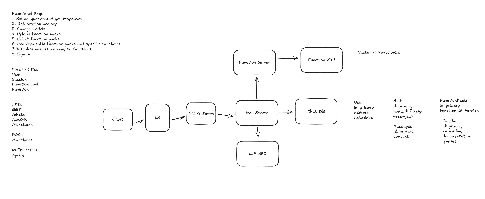

# My Website

## pnpm
  pnpm run dev -> Starts the development server.
  pnpm run build -> Builds the app for production.
  pnpm start -> Runs the built app in production mode.

## Todo
- [X] Make it deploy - Vercel
- [X] Set up blog and book reviews
- [X] Add auth - Clerk
- [X] Scaffold basic chat ui with mock data
- [ ] Web socket for chat
- [ ] State management - Zustand
- [ ] Session history
- [ ] Set up a DB - https://orm.drizzle.team/docs/tutorials/drizzle-with-supabase
- [ ] Set up  a VDB - https://orm.drizzle.team/docs/guides/vector-similarity-search
- [ ] Make it pretty - https://ui.shadcn.com/docs/components/checkbox
- [ ] Error management - Sentry
- [ ] Upload functions 
- [ ] Cluster functions
- [ ] Hook up to LLMs - OpenAI
- [ ] Rate limiting - Upstash
- [ ] Make things pretty - https://www.youtube.com/watch?v=34bRv6cQezo
- [ ] Add image and file upload - UploadThing
- [ ] Analytics - PostHog

### tailwind?
npx tailwindcss -i .\styles\globals.css -o .\styles\output.css

## Blog

## Book Reviews

## FaZaar

A Bizaar for Functionality for an AI Chat Bot.

FaZaar System Design

